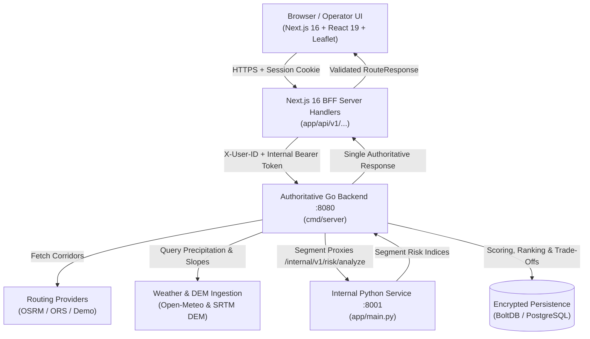
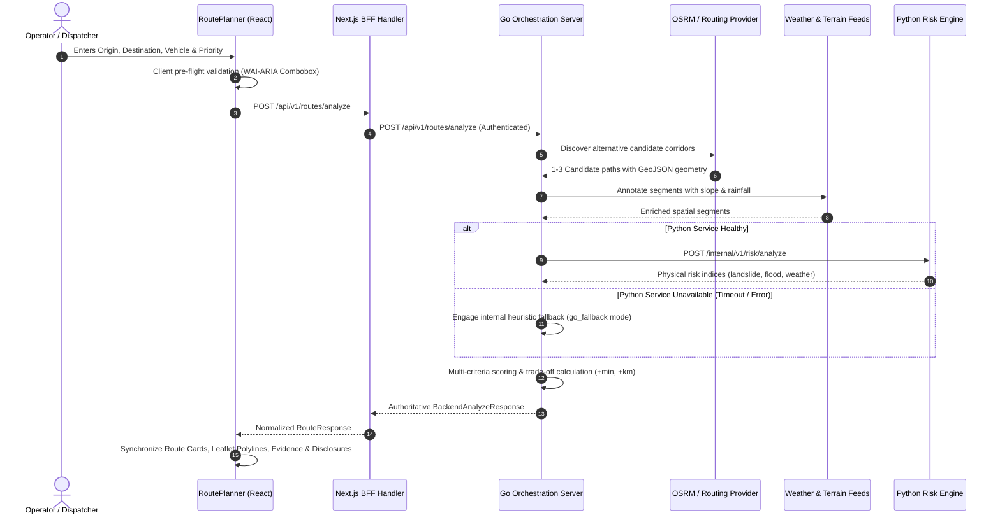
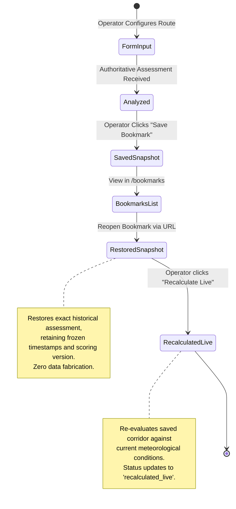

# NER-Connect AI: Disaster-Resilient Logistics & Route Intelligence for Northeast India

NER-Connect AI is an intelligent route-planning and disaster-resilience accessibility platform engineered specifically for the unique terrain and hazard landscape of Northeast India (NER).

---

## 1. Project Objective

To provide emergency responders, humanitarian relief agencies, and logistics operators with transparent, multi-criteria route recommendations that balance travel time, road infrastructure constraints, and dynamic natural hazard exposure across the 8 Northeastern states.

---

## 2. The Problem Being Solved

Standard commercial navigation systems optimize almost exclusively for shortest travel time or distance. In mountainous terrain like Northeast India, this creates dangerous vulnerabilities:
- **Severe Natural Hazards**: Heavy monsoon rainfall triggers frequent landslides, mudslides, and flash flooding in narrow river valleys.
- **Single-Corridor Bottlenecks**: Many highland settlements rely on a single highway artery; uncoordinated routing into closed or hazardous corridors strands critical relief convoys.
- **Infrastructure Constraints**: Steep gradients, narrow switchbacks, and bridge load limits prohibit heavy trucks and fuel tankers from traversing shortcuts that passenger cars might navigate.

NER-Connect AI replaces blind travel-time minimization with risk-aware route orchestration that explicitly evaluates terrain slopes, precipitation levels, vehicle dimensions, and verified road closures.

---

## 3. System Architecture

The architecture enforces strict separation of concerns, fail-closed boundaries, zero secret leakage, and unified authoritative response delivery:



---

## 4. Operational Lifecycles

### A. Route Comparison Request Lifecycle



### B. Bookmark & Assessment Snapshot Lifecycle



---

## 5. Go & Python Responsibilities

| Responsibility | Go Public Backend | Python Intelligence Service |
| :--- | :---: | :---: |
| **Public HTTP Boundary & CORS** | **Sole Owner** | *Internal Only (Port 8001)* |
| **Input Validation & Sanitization** | **Sole Owner** | Feature Schema Validation |
| **Routing Provider Orchestration** | **Sole Owner** | Does Not Route |
| **Live Weather & DEM Ingestion** | **Sole Owner** | Receives Normalized Segments |
| **Road Closures & Vehicle Clearance**| **Sole Owner (Pre-Scoring)**| Does Not Filter Closures |
| **Geohazard Physical Modeling** | Fallback Heuristic Owner | **Primary Advisor** |
| **Settlement Accessibility Evaluation**| High-Level API | Graph & Corridor Analysis |
| **Multi-Criteria Scoring & Ranking**| **Sole Owner** | *Forbidden from Selecting Winner* |
| **Database Persistence & User Isolation**| **Sole Owner** | Stateless |

---

## 6. Explicit Engine Modes

Every assessment returned by the system declares its exact operational mode:

- `live_ml`: Serving approved machine learning inference on complete regional feature sets.
- `live_heuristic`: Active production default utilizing deterministic physical domain heuristics on live weather and terrain feeds.
- `go_fallback`: Automatic Go internal fallback engaged when Python intelligence is unreachable or input features are incomplete.
- `partial`: Operating with partial sensor signals (e.g. live weather provider unreachable); missing features are explicitly surfaced.
- `demo`: Deterministic, offline demonstration scenario (Guwahati → Shillong) using verified static geometry.

---

## 7. Resilience & Fallback Behavior

NER-Connect AI is built to maintain emergency operations during severe infrastructure disruptions:
- **Python Service Outage**: If the Python service crashes, times out, or returns an error, Go does NOT drop the user request. Go automatically transitions to `go_fallback` mode using internal heuristic scoring.
- **Frontend Alerting**: The user interface displays a visible badge (`GO FALLBACK ACTIVE`) and clear warning banners detailing that fallback scoring is in effect.
- **Zero Fabrication Policy**: Missing data is never converted into zero risk. Unmodeled sensors remain `null` and are rendered as *"Not evaluated"* or *"Unavailable"*.
- **Automatic Recovery**: Once the Python service restarts, Go immediately resumes full intelligence scoring on subsequent requests without requiring a backend restart.

---

## 8. Authentication & User Isolation

- **Server-Side BFF Verification**: Browser clients authenticate with Supabase Auth. The Next.js BFF validates the user session server-side and forwards requests to Go with an authenticated `X-User-ID` header.
- **Cryptographic JWT Validation**: Go verifies Supabase HMAC-SHA256 signatures, `iss`, `aud: "authenticated"`, and token expiration (`exp`).
- **Strict Data Isolation**: Every saved analysis and bookmark is stamped with `owner_user_id`. User A cannot read, rename, recalculate, or delete User B's records (HTTP 403 Forbidden is strictly enforced).

---

## 9. Data Sources & Provenance

| Signal / Layer | Source | License | Refresh | Fallback Policy |
| :--- | :--- | :--- | :--- | :--- |
| **Road Network & Routing** | OpenStreetMap / OSRM / ORS | ODbL 1.0 / Apache 2.0 | Weekly extract / live | Fails closed (503) if network unreachable. |
| **Precipitation & Weather** | Open-Meteo (ECMWF & GFS) | CC BY 4.0 | Hourly update | Explicit `degraded` warning; no zero-rain assumption. |
| **Elevation & Slope** | NASA SRTM 90m DEM | Public Domain | Static reference | Cached; central-difference slope estimation. |
| **Advisory & Closures** | Regional Agency Feed | Public Data | Event-driven | Expired feeds trigger cautionary advisories. |

---

## 10. Running Locally

### Prerequisites
- **Node.js**: 20+ (Node 24 recommended)
- **Go**: 1.25+
- **Python**: 3.14+ (with `venv`)

### Step 1: Start Python Intelligence Service
```bash
cd backend/python
python -m venv .venv
# On Windows:
.venv\Scripts\activate
# On Linux/macOS:
source .venv/bin/activate

pip install -r requirements.txt -r requirements-dev.txt
python -m app.main
```
*Health Check:* `http://127.0.0.1:8001/health`

### Step 2: Start Go Backend API (Terminal 2)
```bash
cd backend/go
go run ./cmd/server
```
*Readiness Check:* `http://127.0.0.1:8080/health/ready`

### Step 3: Start Next.js Frontend (Terminal 3)
```bash
cd frontend
npm install
npm run dev
```
*Access UI:* `http://localhost:3000`

---

## 11. Automated Test Suites (76 Tests Passing)

### A. Run All Frontend Automated Tests
```bash
cd frontend
npm test
```
*Direct Node execution:*
```bash
node --experimental-strip-types --test tests/contract.test.ts tests/fixtures.test.ts tests/comparison.test.ts tests/evidence.test.ts tests/bookmarks.test.ts tests/navigation.test.ts tests/failure-matrix.test.ts tests/e2e-journey.test.ts
```

| Test Suite | File | Tests | Coverage Scope |
| :--- | :--- | :---: | :--- |
| **Contract** | `tests/contract.test.ts` | 8 | Normalization, runtime guard, contract validation, degraded fallback handling |
| **Fixtures** | `tests/fixtures.test.ts` | 6 | Static demo schema compliance, ETA/distance formatters, risk score non-fabrication |
| **Comparison** | `tests/comparison.test.ts` | 4 | Fastest route trade-offs (+min, +km), category badges, Leaflet coordinate format |
| **Evidence** | `tests/evidence.test.ts` | 4 | Unmodeled signal null-preservation, spatial hazard markers, metadata propagation |
| **Bookmarks** | `tests/bookmarks.test.ts` | 9 | Snapshot reconstruction, frozen timestamps, status transitions, live recalculation |
| **Navigation** | `tests/navigation.test.ts` | 24 | Active-route matching, open redirect security, auth sanitization, WAI-ARIA combobox |
| **Failure Matrix**| `tests/failure-matrix.test.ts` | 9 | Go 503 offline, 504 timeouts, 500 error propagation, gateway 502, pre-flight guards |
| **E2E Journey** | `tests/e2e-journey.test.ts` | 9 | 9-step full operator workflow: sign-in, compare, select, evidence, bookmark, recalculate |
| **Total** | | **76 / 76 PASS** | **100% Passing (0 failures, ~400ms duration)** |

### B. Run TypeScript Strict Type-Check
```bash
cd frontend
npm run type-check
```
*Result: 0 errors.*

### C. Run Next.js Production Build
```bash
cd frontend
npm run build
```
*Result: Compiled successfully with Turbopack (21/21 static and dynamic pages).*

### D. Run Backend Test Suites
```bash
# Go backend test suite:
cd backend/go
go test -v ./...

# Python intelligence test suite:
cd backend/python
python -m pytest -q
```

---

## 12. Running the SIH Demonstration

Follow the full presentation sequence in [`docs/SIH_DEMO_RUNBOOK.md`](docs/SIH_DEMO_RUNBOOK.md):
1. **Normal Flow**: Plan Guwahati → Shillong (Emergency, Truck). Observe exact geometry, badges, and recommendation rationale.
2. **Bookmark Flow**: Save bookmark, refresh, reopen from `/bookmarks`, and trigger live recalculation.
3. **Fallback Flow**: Terminate Python process (`Ctrl+C`). Rerun route analysis in browser. Confirm Go remains operational, switches to `GO FALLBACK ACTIVE`, and surfaces informative alerts.
4. **Recovery Flow**: Restart Python. Rerun route analysis. Confirm instantaneous recovery to healthy intelligence.

---

## 13. Project Structure

```
ner-connect-ai/
├── .github/workflows/          # GitHub Actions CI (Ubuntu race, vet, pytest, docker, frontend)
├── backend/
│   ├── go/                     # Authoritative public Go backend
│   │   ├── cmd/server/         # HTTP server entrypoint
│   │   ├── internal/
│   │   │   ├── api/            # Route handlers, OpenAPI 2.0, bookmarks CRUD
│   │   │   ├── database/       # BoltDB & PostgreSQL repositories, user isolation
│   │   │   ├── intelligence/   # Internal HTTP client for Python & fallback engine
│   │   │   ├── middleware/     # Auth, Supabase JWT verification, rate limiting, logging
│   │   │   ├── routing/        # OSRM, OpenRouteService, and Demo providers
│   │   │   ├── scoring/        # Multi-criteria scoring, trade-off guards, ranking
│   │   │   └── weather/        # Open-Meteo weather integration
│   │   └── Dockerfile          # Multi-stage unprivileged container build
│   └── python/                 # Internal Python intelligence service
│       ├── app/                # FastAPI application, schemas, and heuristic engines
│       ├── model_artifacts/    # Cryptographically verified model weights
│       ├── tests/              # Pytest suite (86 contract, heuristic, and unit tests)
│       └── Dockerfile          # Hardened Python 3.14 container build
├── frontend/                   # Next.js 16 / React 19 Frontend
│   ├── app/                    # App Router pages and trusted BFF proxy handlers
│   ├── components/             # RoutePlanner, LeafletMap, RouteCard, RouteForm
│   ├── lib/
│   │   ├── api/                # Authoritative typed client & contract validators
│   │   ├── demo/               # Verified Guwahati → Shillong offline demo fixtures
│   │   ├── navigation/         # Accessible navigation & location filtering utilities
│   │   ├── supabase/           # Client/server auth handlers (anon key only)
│   │   └── types.ts            # Frozen TypeScript contracts (OpenAPI 3.1.0)
│   └── tests/                  # 8 test suites (76 unit, contract, failure & E2E tests)
├── docs/                       # Runbooks, architecture docs, performance reports
├── legacy/                     # Quarantined legacy synthetic models
├── scripts/                    # Test suites, benchmarks, and smoke test utilities
├── ARCHITECTURE_DECISIONS.md   # Architectural Decision Records (ADR 001–007)
├── DATA_STATUS.md              # Data provenance and license registry
├── IMPLEMENTATION_STATUS.md    # Full 9-phase execution and verification registry
├── MODEL_STATUS.md             # Scientific status and model limitations registry
└── compose.yaml                # Multi-service production deployment manifest
```
