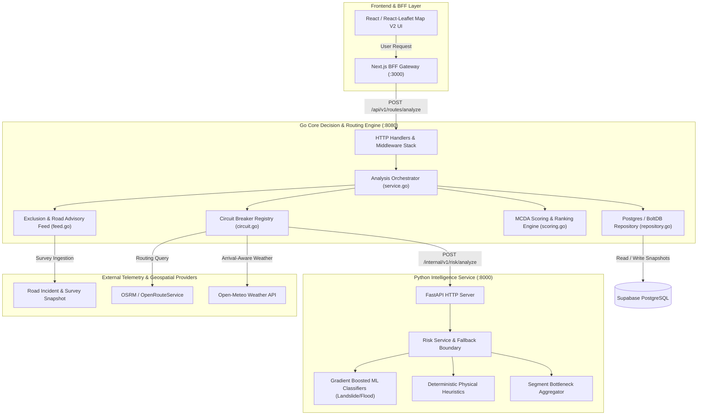
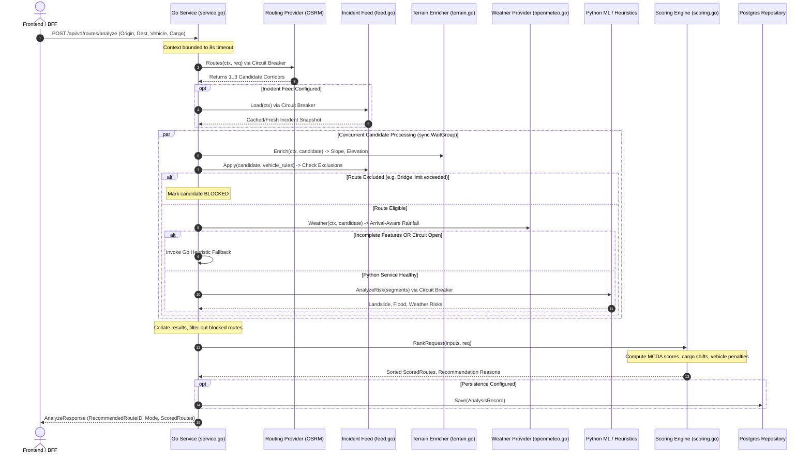
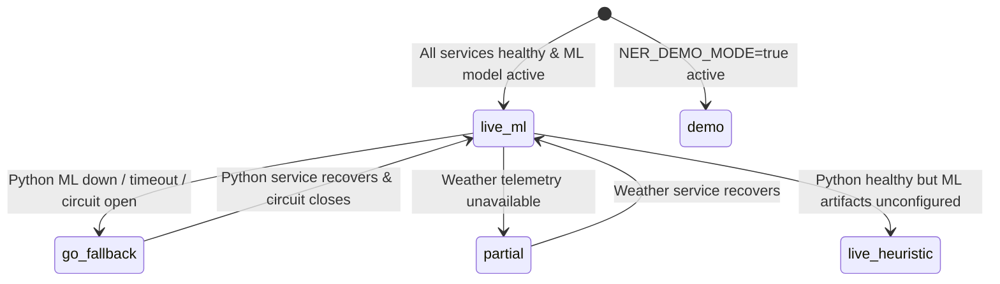

# NER-Connect AI — Complete Backend Architecture & Technical Reference (A to Z)

> **Document Version**: 2.0.0  
> **Target Audience**: Technical Architects, Backend Engineers, Geospatial Data Scientists, DevOps/SRE, Security Auditors  
> **Scope**: Go Core Decision & Routing Engine (`backend/go`) and Python Intelligence Service (`backend/python`)

---

## Table of Contents
1. [Executive Summary & System Purpose](#1-executive-summary--system-purpose)
2. [High-Level System Topology & Separation of Concerns](#2-high-level-system-topology--separation-of-concerns)
3. [Core Architectural Invariants](#3-core-architectural-invariants)
4. [Go Core Routing & Decision Engine (`backend/go`)](#4-go-core-routing--decision-engine-backendgo)
   - [4.1 Lifecycle & Server Architecture](#41-lifecycle--server-architecture)
   - [4.2 Configuration & Environment Matrix](#42-configuration--environment-matrix)
   - [4.3 HTTP API, Routing & Middleware Stack](#43-http-api-routing--middleware-stack)
   - [4.4 Analysis Orchestrator & Request Flow](#44-analysis-orchestrator--request-flow)
   - [4.5 Routing Providers (OSRM, ORS, Demo)](#45-routing-providers-osrm-ors-demo)
   - [4.6 Weather Telemetry Integration](#46-weather-telemetry-integration)
   - [4.7 Exclusion Engine, Terrain & Road Advisory Feeds](#47-exclusion-engine-terrain--road-advisory-feeds)
   - [4.8 Multi-Criteria Scoring & Ranking Engine](#48-multi-criteria-scoring--ranking-engine)
   - [4.9 Circuit Breaker Registry & Fault Tolerance](#49-circuit-breaker-registry--fault-tolerance)
   - [4.10 Database & Snapshot Persistence](#410-database--snapshot-persistence)
5. [Python Intelligence Service (`backend/python`)](#5-python-intelligence-service-backendpython)
   - [5.1 FastAPI Architecture & Lifespan](#51-fastapi-architecture--lifespan)
   - [5.2 Heuristic Risk Engine](#52-heuristic-risk-engine)
   - [5.3 Machine Learning Risk Engine](#53-machine-learning-risk-engine)
   - [5.4 Micro-Segment Hazard Aggregation Formula](#54-micro-segment-hazard-aggregation-formula)
   - [5.5 Model Training & Data Pipelines](#55-model-training--data-pipelines)
6. [Inter-Service Communication & Failure Matrix](#6-inter-service-communication--failure-matrix)
7. [API Contracts & Schema Specifications](#7-api-contracts--schema-specifications)
8. [Security, Authentication & Data Protection](#8-security-authentication--data-protection)
9. [Operational Runbook, Testing & Deployment](#9-operational-runbook-testing--deployment)

---

## 1. Executive Summary & System Purpose

Northeast India (NER) presents one of the most perilous and logistically complex operating environments in the world. Characterized by fragile Himalayan geology, high seismic vulnerability, torrential monsoon precipitation exceeding 2,500 mm annually, and narrow transport arteries (such as the 22-kilometer-wide Siliguri Corridor / "Chicken's Neck"), logistical supply chains face frequent disruption due to catastrophic landslides, flash floods, bridge washouts, and road slips.

Standard commercial routing engines (e.g., Google Maps, Apple Maps, commercial OSRM instances) optimize almost exclusively for **nominal travel time** or **distance**, frequently directing emergency convoys and heavy freight into active disaster choke points, washed-out mountain passes, or roads exceeding bridge load ratings.

**NER-Connect AI** solves this critical operational vulnerability by providing a **disaster-resilient multi-criteria routing, hazard evaluation, and decision engine**. The backend system dynamically orchestrates:
- Real-time road network geometries
- Live arrival-aware meteorology
- Digital elevation and slope dynamics
- Road condition surveys and bridge load limits
- Statistical and machine-learned hazard susceptibility models
- Operational vehicle and cargo policies

---

## 2. High-Level System Topology & Separation of Concerns

The backend is architected as two decoupled, specialized services operating in tandem:



### Strategic Division of Responsibility:
| Dimension | Go Core Engine (`backend/go`) | Python Intelligence Service (`backend/python`) |
| :--- | :--- | :--- |
| **Primary Mandate** | **Decision Authority & Orchestration** | **Hazard Susceptibility Inference** |
| **Language & Runtime** | Go 1.23+ (Compiled, highly concurrent) | Python 3.11+ / FastAPI / Uvicorn |
| **Candidate Corridors** | Authoritative generator & evaluator | Completely unaware of route generation |
| **Physical Constraints** | Vehicle height/weight limits, bridge ratings | None (operates purely on segment telemetry) |
| **Hazard Inference** | Deterministic fallback heuristics & rules | Statistical ML models (XGBoost / LightGBM) |
| **Scoring & Ranking** | Multi-Criteria Decision Analysis (MCDA) | Returns hazard indices (0.0 to 1.0) |
| **Persistence** | PostgreSQL, BoltDB, In-Memory Snapshots | Stateless (no database connection) |
| **Fault Mode** | Degrades gracefully to heuristic scoring | Bounded fallback to heuristic engine |

---

## 3. Core Architectural Invariants

The backend codebase enforces four non-negotiable architectural invariants:

1. **Go is the Sole Routing and Decision Authority**:  
   Neither the browser nor the Python ML service may ever invent, modify, or rank route candidates. Go queries authoritative network geometry, enforces physical constraints, scores candidates, and issues final corridor recommendations.
2. **Zero Hazard Risk Fabrication**:  
   If an environmental sensor, weather provider, or ML inference signal is offline or missing, the system **never** coerces the missing metric to `0.0` or classifies the route as "Safe". Missing values are explicitly preserved as `null` or marked `"Unavailable"` / `"Not Evaluated"`.
3. **Bounded Contexts & Circuit Breaking**:  
   Every external network call (routing providers, meteorology, Python ML, database) is wrapped in strict timeout budgets (typically 3 to 8 seconds) and monitored by a finite-state circuit breaker (`CLOSED`, `OPEN`, `HALF_OPEN`). A failure in Python ML never crashes Go; the system automatically falls back to deterministic Go heuristics (`go_fallback` mode).
4. **Frozen Assessment Snapshots**:  
   Saved bookmarks store an immutable JSON snapshot of the scored route geometry and hazard telemetry at the time of evaluation. Viewing a bookmark never triggers re-routing; recalculation is only executed upon explicit user request.

---

## 4. Go Core Routing & Decision Engine (`backend/go`)

### 4.1 Lifecycle & Server Architecture
- **Location**: `backend/go/cmd/server/main.go`
- **Architecture**: Clean architecture pattern with strict separation between `api` (HTTP/transport), `config`, `models`, `routing`, `weather`, `features`, `intelligence`, `scoring`, and `database`.
- **Startup Sequence**:
  1. Configuration is loaded and validated from environment variables (`config.Load()`).
  2. Bounded HTTP clients are configured with specialized timeout profiles.
  3. Providers are instantiated based on mode (Demo mode vs. Production OSRM/Open-Meteo).
  4. Circuit breaker registry is initialized for routing, weather, terrain, feed, and intelligence.
  5. Persistence repository is initialized (PostgreSQL if `DATABASE_URL` is set, else BoltDB or In-Memory).
  6. HTTP server is bound with graceful shutdown listening for `SIGINT` and `SIGTERM`.

### 4.2 Configuration & Environment Matrix

The Go service is configured via `internal/config/config.go`. All variables have strict defaults and validation:

| Environment Variable | Default | Description |
| :--- | :--- | :--- |
| `GO_PORT` | `8080` | Port for the Go HTTP service |
| `GO_HOST` | `127.0.0.1` | Network interface binding |
| `NER_ENV` | `development` | Operating environment (`development`, `staging`, `production`) |
| `NER_DEMO_MODE` | `true` | When `true`, enables deterministic benchmark corridors |
| `PYTHON_SERVICE_URL` | `http://localhost:8001` | Upstream URL of the Python intelligence service |
| `PYTHON_TIMEOUT_SECONDS` | `5` | Maximum execution timeout for Python ML inference |
| `ROUTING_PROVIDER` | `osrm` | Upstream routing engine (`osrm`, `ors`, `demo`) |
| `ROUTING_SERVICE_URL` | *None* | OSRM / ORS base API URL (required if `NER_DEMO_MODE=false`) |
| `WEATHER_PROVIDER` | `openmeteo` | Weather provider (`openmeteo`, `demo`) |
| `WEATHER_SERVICE_URL` | *None* | Base URL for weather API |
| `DATABASE_URL` | *None* | Supabase / PostgreSQL connection string |
| `DATA_PATH` | `data/ner-connect.db` | Fallback BoltDB file path for embedded persistence |
| `ROAD_HAZARD_DATA_PATH` | *None* | Local filesystem path to road survey incident JSON snapshot |
| `ROAD_HAZARD_DATA_URL` | *None* | Remote HTTP endpoint for live road survey incident snapshots |
| `API_TOKEN` | *None* | Shared secret for inter-service authentication |
| `LOG_LEVEL` | `info` | Logging verbosity (`debug`, `info`, `warn`, `error`) |

### 4.3 HTTP API, Routing & Middleware Stack

The HTTP layer is defined in `internal/api/handler.go` utilizing standard Go 1.22+ `http.ServeMux` with pattern matching.

#### Endpoints Catalogue:
```
GET    /health                                     # Basic liveness probe
GET    /health/live                                # Kubernetes liveness probe
GET    /health/ready                               # Detailed readiness probe (checks DB, Python, OSRM)
POST   /api/v1/routes/analyze                      # Primary multi-corridor route evaluation endpoint
POST   /api/v1/routes/compare                      # Compare specific pre-computed route candidate geometries
POST   /api/v1/tools/routes/compare-supplied       # Tooling endpoint for benchmark analysis
GET    /api/v1/locations                           # Static catalogue of known transit hubs in NER
POST   /api/v1/locations/{id}/accessibility        # Single-location accessibility assessment
GET    /api/v1/analyses                            # Retrieve user assessment history
GET    /api/v1/analyses/{id}                       # Retrieve single historical assessment record
DELETE /api/v1/analyses/{id}                       # Delete historical assessment record
POST   /api/v1/bookmarks                           # Save an assessment as an immutable bookmark
GET    /api/v1/bookmarks                           # List bookmarks for authenticated user
GET    /api/v1/bookmarks/{id}                      # Get specific bookmark with frozen snapshot
PATCH  /api/v1/bookmarks/{id}                      # Rename bookmark
DELETE /api/v1/bookmarks/{id}                      # Delete bookmark
POST   /api/v1/bookmarks/{id}/recalculate          # Perform fresh live analysis of bookmarked endpoints
GET    /api/v1/openapi.json                        # OpenAPI 3.0 specification
```

#### Middleware Pipeline (`internal/middleware/`):
1. **Request Tracing (`RequestID`)**: Checks incoming `X-Request-ID` header; if missing, generates an RFC-4122 UUIDv4 and injects it into context and response headers.
2. **Payload Protection (`MaxBytesReader`)**: Restricts request body size to `1 << 20` (1 MB) to prevent denial-of-service memory exhaustion.
3. **Strict JSON Parsing**: Enables `dec.DisallowUnknownFields()` to reject unrecognized parameters.
4. **Rate Limiting (`RateLimit`)**: In-memory token bucket rate limiter tracking requests by client IP with automated stale entry pruning.
5. **Authentication & Authorization (`Authenticate`)**:
   - Compares `Authorization: Bearer <token>` using constant-time HMAC-SHA256 (`crypto/subtle.ConstantTimeCompare`) against configured `API_TOKEN`.
   - Validates Supabase JWTs by extracting the `sub` claim and verifying the HMAC-SHA256 signature using `SUPABASE_JWT_SECRET`.
   - Populates authenticated `UserID` into the request `context.Context`.

### 4.4 Analysis Orchestrator & Request Flow (`internal/api/service.go`)

When a client submits `POST /api/v1/routes/analyze`, the orchestrator executes the following high-concurrency pipeline:



### 4.5 Routing Providers (`internal/routing/`)
- **`Provider` Interface**: Defines `Routes(context.Context, AnalyzeRequest) ([]RouteCandidate, error)` and `Healthy(context.Context) bool`.
- **`OSRMProvider` (`osrm.go`)**: Queries an upstream OSRM instance with `alternatives=true&overview=full&geometries=geojson&steps=true`. Samples polyline coordinates into discrete road segments (spacing ~5 to 10 km).
- **`ORSProvider` (`ors.go`)**: Alternative integration supporting OpenRouteService direction APIs with elevation profiles.
- **`DemoProvider` (`routing.go`)**: High-fidelity benchmark provider for Northeast India. Deterministically returns three real corridors between Guwahati (Assam) and Shillong (Meghalaya):
  1. `route-a`: Direct mountain highway via NH-06 (Fastest, 99.4 km, 176 min, but steep 38° slopes and high historical landslide frequency).
  2. `route-b`: Western bypass corridor via Nongpoh (Recommended, 103.2 km, 188 min, gentle 12° slope, high reliability score of 0.92).
  3. `route-c`: Eastern valley detour via Jagi Road / Umroi (Longest, 116.8 km, 211 min, low elevation, moderate road quality).

### 4.6 Weather Telemetry Integration (`internal/weather/`)
- **`OpenMeteoProvider` (`openmeteo.go`)**:
  - Batches segment coordinates (up to 16 sampled points) into a single HTTP query:  
    `GET /v1/forecast?latitude=...&longitude=...&hourly=rain&forecast_hours=24`.
  - **Arrival-Aware Weather Window**: Instead of querying instantaneous rainfall at departure time, the provider calculates the estimated arrival timestamp at *each individual segment* based on progressive transit time along the corridor. It extracts the corresponding hourly rainfall forecast for that specific arrival window.
- **Risk Mapping**:
  - `0 - 5 mm/h`: Low risk
  - `5 - 15 mm/h`: Moderate risk
  - `15 - 35 mm/h`: High risk
  - `> 35 mm/h`: Severe torrential risk

### 4.7 Exclusion Engine, Terrain & Road Advisory Feeds (`internal/features/`)
- **Advisory Feed Snapshot (`feed.go`)**:
  - Ingests structured JSON incident survey snapshots containing road closures, active mudslides, bridge load limits, and maximum height clearances.
  - Geospatial evaluation: Iterates through all coordinates of a candidate route. If any point falls within the impact radius (`radius_km`, calculated via the Haversine distance formula) of an active restriction:
    - **Physical Vehicle Exclusions**: If `vehicle_dimensions.weight_t > max_weight_t` or `height_m > max_height_m`, the candidate is **strictly excluded** with policy audit note: `"Vehicle weight (X t) exceeds bridge rating (Y t)"`.
    - **Road Closures**: If a section is marked impassable, the candidate route is excluded from consideration.
- **Terrain Enrichment (`terrain.go`)**:
  - Evaluates digital elevation model (DEM) metrics for every segment. Calculates slope gradient in degrees (`slope_deg`) and absolute elevation (`elevation_m`). Identifies high-risk mountain passes.

### 4.8 Multi-Criteria Scoring & Ranking Engine (`internal/scoring/scoring.go`)

The scoring engine implements Multi-Criteria Decision Analysis (MCDA). It transforms raw distances, transit times, and hazard probabilities into an explainable, normalized preference score.

#### 1. Normalization Functions
To prevent extreme outliers from skewing multi-route comparisons:
$$\text{InverseWithGuard}(x, \min, \max, \text{guard}) = \text{clamp}\left(1 - \frac{x - \min}{\max - \min + 10^{-6}}\right)$$
Bounded by a maximum penalty multiplier (`guard`), ensuring a route that is 2x longer does not collapse the entire evaluation to zero.

#### 2. Hazard & Safety Formulation
$$\text{Hazard} = 0.50 \cdot \text{LandslideRisk} + 0.25 \cdot \text{FloodRisk} + 0.25 \cdot \text{WeatherRisk}$$
$$\text{Safety} = \text{clamp}(1 - \text{Hazard})$$

#### 3. Reliability Formulation
$$\text{Reliability} = \text{clamp}(0.40 \cdot \text{RoadCondition} + 0.35 \cdot \text{Safety} + 0.25 \cdot \text{Accessibility}) \cdot (0.5 + 0.5 \cdot \text{FeatureCoverage})$$

#### 4. Weight Profiles & Dynamic Cargo Adjustments
Baseline policy weights:
| Profile | Safety | Reliability | Accessibility | ETA | Weather | Distance |
| :--- | :--- | :--- | :--- | :--- | :--- | :--- |
| **Normal** | 0.25 | 0.20 | 0.20 | 0.15 | 0.10 | 0.10 |
| **Emergency** | 0.35 | 0.25 | 0.20 | 0.15 | 0.00 | 0.05 |
| **Fastest** | 0.15 | 0.10 | 0.10 | 0.55 | 0.05 | 0.05 |
| **Safest** | 0.60 | 0.15 | 0.15 | 0.00 | 0.10 | 0.00 |

**Dynamic Cargo Shifts**:
- **Perishable Food**: Shifts 5% weight from Distance to ETA:  
  `weights.Distance -= 0.05; weights.ETA += 0.05`
- **Medical Supplies / Emergency Equipment / Passengers**: Shifts 5% weight from Distance to Safety:  
  `weights.Distance -= 0.05; weights.Safety += 0.05`

**Vehicle Penalties**:
- **Motorcycle**: Accessibility penalized up to 25% by active rainfall:  
  $\text{Access} = \text{Access} \cdot (1 - 0.25 \cdot \text{WeatherRisk})$
- **Heavy Truck**: Accessibility discounted for degraded road conditions:  
  $\text{Access} = \text{Access} \cdot (0.8 + 0.2 \cdot \text{RoadCondition})$

#### 5. Recommendation Reasons Generation
The engine analyzes the top-ranked corridor against competitors and generates structured reasons:
- `LOWEST_LANDSLIDE_RISK`: Selected route avoids active slope instability.
- `SIGNIFICANT_ETA_ADVANTAGE`: Selected route offers faster transit with acceptable safety margins.
- `BALANCED_SAFETY_PROFILE`: Compromise candidate optimal across conflicting constraints.

### 4.9 Circuit Breaker Registry & Fault Tolerance (`internal/circuit/`)

External calls are isolated by instance breakers:
```go
type Breaker struct {
    name          string
    state         State // CLOSED, OPEN, HALF_OPEN
    failures      int
    failureThresh int   // Default: 3
    cooldown      time.Duration // Default: 15s
}
```
- **Execution Flow**:
  - `CLOSED`: Normal operation. Failures increment failure counter. Once failures $\ge 3$, state transitions to `OPEN`.
  - `OPEN`: Immediate fail-fast. No outbound network requests are dispatched. Returns `ErrCircuitOpen`. After 15 seconds cooldown, transitions to `HALF_OPEN`.
  - `HALF_OPEN`: Allows a single probe request. If successful, resets failure count and transitions to `CLOSED`. If failed, re-opens for another cooldown period.

### 4.10 Database & Snapshot Persistence (`internal/database/`)

The repository interface (`Repository`, `HistoryRepository`, `BookmarkRepository`) abstracts persistence across environments:
1. **`PostgresRepository` (`postgres.go`)**:
   - Production implementation targeting Supabase / PostgreSQL.
   - Manages tables: `analysis_records` and `bookmarks`.
   - Uses connection pooling (`sql.DB`) and prepared parameterized statements to eliminate SQL injection.
   - Enforces user isolation: queries require `owner_user_id` matching the authenticated caller.
2. **`BoltRepository` (`bolt.go`)**:
   - Embedded key-value database using `bbolt` for edge deployments where external PostgreSQL is inaccessible.
3. **`InMemoryRepository` (`repository.go`)**:
   - Mutex-synchronized memory store for unit testing.
4. **Pruning Strategy (`PruneOlderThan`)**:
   - Automatically cleans up historical analysis records older than retention limit (e.g., 30 days) while preserving user-created bookmarks indefinitely.

---

## 5. Python Intelligence Service (`backend/python`)

### 5.1 FastAPI Architecture & Lifespan
- **Location**: `backend/python/app/main.py`
- **Framework**: FastAPI on Python 3.11+, served via Uvicorn.
- **Lifespan Manager**: On application startup, loads settings and instantiates `RiskService`. Checks model artifact integrity.
- **Endpoints**:
  - `GET /health`: Returns service health, active mode (`ml` vs `heuristic`), model version, and readiness flags.
  - `POST /internal/v1/risk/analyze`: Accepts route segments, executes inference, and returns aggregated hazard scores.
  - `POST /internal/v1/risk/explain`: Returns detailed per-segment driver contributions and feature attributions.

### 5.2 Heuristic Risk Engine (`app/risk/heuristics.py`)

When ML artifacts are unconfigured or fail verification, the service executes deterministic physical heuristics:
- **Scaling Parameters**:
  - Rainfall Scale: $100\text{ mm}$
  - Slope Scale: $45^\circ$
  - Elevation Scale: $3,000\text{ m}$
  - Historical Landslides Scale: $10\text{ events}$
- **Formulation**:
  $$\text{LandslideScore} = \text{clamp}(0.40 \cdot \text{Rain} + 0.35 \cdot \text{Slope} + 0.15 \cdot \text{History} + 0.10 \cdot (1 - \text{RoadCondition}))$$
  $$\text{FloodScore} = \text{clamp}(0.50 \cdot \text{Rain} + 0.30 \cdot (1 - \text{Elevation}) + 0.20 \cdot (1 - \text{Slope}))$$

### 5.3 Machine Learning Risk Engine (`app/risk/ml.py`)

The ML engine replaces heuristic coefficients with trained scikit-learn / LightGBM models loaded from versioned artifacts (`model_artifacts/`):
- **Features (`app/features.py`)**:
  - `rainfall_mm`: 24-hour accumulated rainfall forecast
  - `slope_deg`: Topographical slope derived from DEM
  - `elevation_m`: Elevation above sea level
  - `historical_landslides`: Frequency of past recorded slope failures
  - `road_condition_score`: Surface pavement and maintenance rating (0-100)
- **Model Loading & Verification (`app/models/artifacts.py`)**:
  - Models are serialized with metadata hashes, required feature names, and expected model versions.
  - If feature schema mismatches or unpickling fails, `ArtifactError` is raised, triggering immediate fallback to the heuristic engine.

### 5.4 Micro-Segment Hazard Aggregation Formula (`app/risk/aggregation.py`)

A critical challenge in route hazard evaluation is that an arithmetic average washes out catastrophic bottlenecks. A route with 99 km of dry highway and 1 km of active mudslide would average to "safe" under mean aggregation.

NER-Connect solves this via **Bottleneck-Weighted Percentile Aggregation**:

$$\text{RouteHazardScore} = 0.60 \cdot \max(\text{Segments}) + 0.40 \cdot P_{90}(\text{Segments})$$
$$\text{RouteAccessibilityScore} = 0.60 \cdot \min(\text{Segments}) + 0.40 \cdot \text{mean}(\text{Segments})$$

- $\max(\text{Segments})$: Captures the single worst hazard choke point on the entire corridor.
- $P_{90}(\text{Segments})$: Captures the generalized high-risk exposure across the top decile of the route.
- $\min(\text{Segments})$: A route is only as accessible as its narrowest constriction.

### 5.5 Model Training & Data Pipelines (`backend/python/training/`)
- Contains synthetic data generators, NASA Global Landslide Catalog parsers, and spatial cross-validation scripts (`spatial_validation.py`).
- Implements spatial group k-fold cross-validation to ensure models do not overfit to specific geographic coordinate clusters.

---

## 6. Inter-Service Communication & Failure Matrix

### Intelligence Mode State Machine

The Go backend dynamically tags every response with its operational `IntelligenceMode`:



### Complete Failure Handling Matrix

| Scenario | Symptom | Detection Mechanism | System Action & User Impact |
| :--- | :--- | :--- | :--- |
| **Go Backend Offline** | Frontend cannot reach `:8080` | Fetch fails with `ECONNREFUSED` | Frontend displays non-fabricated error banner with retry action. Zero fake routes shown. |
| **Python ML Offline** | Python crashes or port `:8001` unreachable | 5s timeout or circuit breaker `OPEN` | Go automatically activates internal Go heuristic fallback. Routes remain fully available. Mode tagged `go_fallback`. Warning: *"Heuristic estimates used."* |
| **Python ML Degraded** | ML artifact corrupted or inputs rejected | HTTP 422 / 500 from Python | Python falls back internally to `HeuristicRiskEngine` or Go executes fallback. No request crash. |
| **Weather API Offline** | Open-Meteo timeout or rate limited | 5s timeout or circuit breaker `OPEN` | Route analysis proceeds without rainfall features. Mode tagged `partial`. Warning: *"Weather unavailable; dry conditions not assumed."* Hazard scores strictly avoid fabricating 0%. |
| **OSRM Routing Offline** | Upstream road network engine fails | 8s timeout or HTTP 502/504 | In production: Fails fast with clear operational advisory. In demo mode: Seamlessly serves canonical benchmark corridors. |
| **PostgreSQL Offline** | Database connection refused | Database circuit breaker / ping failure | Route analysis completes and returns in-memory results. Field `persisted: false`. Warning: *"Assessment could not be saved to history."* |
| **Vehicle Limit Exceeded** | Truck height/weight > bridge rating | `feed.go` restriction check | Candidate corridor is strictly blocked. Explanatory exclusion reason included in response warnings. |

---

## 7. API Contracts & Schema Specifications

### `POST /api/v1/routes/analyze` — Request Payload

```json
{
  "origin": "Guwahati",
  "destination": "Shillong",
  "vehicle": "truck",
  "cargo": "medical_supplies",
  "priority": "safest",
  "vehicle_dimensions": {
    "weight_t": 16.5,
    "height_m": 3.8,
    "width_m": 2.5,
    "length_m": 10.2,
    "axle_load_t": 8.0
  }
}
```

### `POST /api/v1/routes/analyze` — Response Payload

```json
{
  "schema_version": "2.0",
  "request_id": "c4b1e84a-9e12-4d82-8e77-2f689e4726b1",
  "recommended_route_id": "route-b",
  "intelligence_mode": "live_ml",
  "scoring_version": "2.0",
  "persisted": true,
  "generated_at": "2026-09-24T05:15:30.124Z",
  "recommendation_reasons": [
    {
      "code": "LOWEST_LANDSLIDE_RISK",
      "type": "safety",
      "message": "Selected corridor avoids critical slope hazards along the NH-06 mountain face.",
      "evidence": {
        "landslide_risk": 0.18,
        "competitor_risk": 0.64
      }
    }
  ],
  "routes": [
    {
      "route_id": "route-b",
      "distance_km": 103.2,
      "eta_minutes": 188.0,
      "final_score": 0.86,
      "safety_score": 0.88,
      "reliability_score": 0.89,
      "accessibility_score": 0.82,
      "landslide_risk": 0.18,
      "flood_risk": 0.12,
      "weather_risk": 0.15,
      "risk_level": "low",
      "recommendation": "Recommended Corridor",
      "reason": "Optimal safety-to-transit ratio avoiding active slope instability.",
      "model_mode": "ml",
      "reliability_percent": 89.4,
      "hazards": {
        "landslide": {
          "availability": "available",
          "method": "ml",
          "risk_index": 0.18,
          "risk_level": "low",
          "input_completeness": 1.0,
          "source_quality": "high",
          "validated_region": "ner_validated"
        },
        "flood": {
          "availability": "available",
          "method": "heuristic",
          "risk_index": 0.12,
          "risk_level": "low",
          "input_completeness": 1.0,
          "source_quality": "medium"
        },
        "weather": {
          "availability": "available",
          "method": "live_provider",
          "risk_index": 0.15,
          "risk_level": "low",
          "data_time": "2026-09-24T05:00:00Z"
        }
      },
      "geojson": {
        "type": "LineString",
        "coordinates": [
          [91.7362, 26.1445],
          [91.7100, 26.1100],
          [91.8933, 25.5788]
        ]
      },
      "data_quality": {
        "routing_source": "osrm",
        "weather_source": "openmeteo",
        "terrain_source": "srtm_dem",
        "retrieved_at": "2026-09-24T05:15:28Z",
        "weather_arrival_aware": true,
        "feature_coverage": 1.0,
        "warnings": []
      },
      "policy_notes": [
        "Medical cargo shifts 5% distance weight to safety."
      ],
      "score_breakdown": {
        "safety": 0.352,
        "reliability": 0.178,
        "accessibility": 0.164,
        "eta": 0.112,
        "weather": 0.054
      }
    }
  ],
  "warnings": [
    "Planning estimates only: no calibrated hazard probability or clearance certificate. Confirm local conditions before travel."
  ]
}
```

---

## 8. Security, Authentication & Data Protection

### 1. Zero External Key Leakage
- Upstream geocoding, OSRM, OpenRouteService, and weather API keys reside exclusively in backend environment variables.
- The client application communicates strictly with Next.js BFF and Go API endpoints. No provider keys are compiled into browser bundles.

### 2. Dual Authentication Model
- **User Requests**: The Next.js BFF proxies client requests with the user's Supabase JWT in the `Authorization: Bearer <jwt>` header. The Go middleware validates the cryptographic HMAC-SHA256 signature, parses claims, and enforces user isolation.
- **Service-to-Service Requests**: When called directly by internal microservices, the Go API verifies the `Authorization: Bearer <API_TOKEN>` header using constant-time byte slice comparison to eliminate timing attacks.

### 3. Denial of Service Protection
- HTTP body reader is capped at 1 MB via `http.MaxBytesReader`.
- Rate limiting enforces per-IP token bucket quotas.
- Recursive JSON structures and unexpected keys are rejected immediately by strict decoders.

---

## 9. Operational Runbook, Testing & Deployment

### Local Development Setup

#### Terminal 1: Python Intelligence Service
```bash
cd backend/python
# Ensure virtual environment is active
python -m venv .venv
.venv\Scripts\activate  # Windows
source .venv/bin/activate  # Linux/macOS

# Install dependencies
pip install -r requirements.txt

# Start FastAPI service
python -m uvicorn app.main:app --host 127.0.0.1 --port 8000 --reload
```
*Health Check*: `curl http://127.0.0.1:8000/health` → `{"status": "ok", ...}`

#### Terminal 2: Go Core Engine
```bash
cd backend/go

# Run tests
go test -v -race ./...

# Start Go service
go run ./cmd/server
```
*Health Check*: `curl http://127.0.0.1:8080/health/ready` → `{"status": "ready", ...}`

#### Terminal 3: Next.js Frontend
```bash
cd frontend
pnpm dev # or npm run dev
```
*Access in browser*: `http://localhost:3000`

---

### Automated Test Suites

- **Go Unit & Integration Tests**:
  - `go test -v ./internal/api`: API handler, route comparison, OpenAPI contract tests.
  - `go test -v ./internal/scoring`: Mathematical normalization, cargo shift, and ranking tests.
  - `go test -v ./internal/circuit`: Circuit breaker state transitions and cooldown probes.
  - `go test -v ./internal/features`: Vehicle dimension and road closure exclusion tests.
  - `go test -v ./internal/database`: Repository isolation, retention pruning, and bookmark persistence.
- **Python ML Tests**:
  - `pytest tests/`: Heuristic scaling, ML artifact verification, segment aggregation formulas.
- **Contract & Resilience Tests**:
  - `npm test` in `frontend/`: 103 automated tests verifying BFF failure normalization, Go degradation handling, and non-fabrication of risk telemetry.

---

### Production Docker Containerization

Both services include multi-stage Dockerfiles for minimal production attack surface:
- **`backend/go/Dockerfile`**: Compiles static binary using `golang:1.23-alpine`, copies to unprivileged `scratch` or `alpine:latest` container with CA certificates. Image size < 25 MB.
- **`backend/python/Dockerfile`**: Uses `python:3.11-slim`, installs non-root user, copies only inference dependencies.
